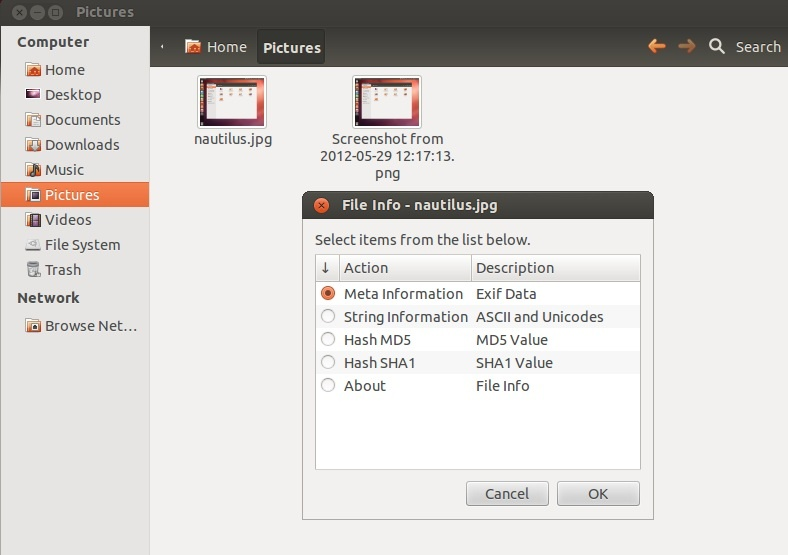

# Testing relative links in markdown

* 
* [samedir blank](01 All Step-by-Step Guides)
* [samedir md](01 All Step-by-Step Guides.md)
* [samedir html](01 All Step-by-Step Guides.html)
* [other dir](/01 About/01 About.html)
* [other dir newdocstest](/newdocstest/01 About/01 About.html)
* [other dir noslash](01 About/01 About.html)
* [other dir newdocstest noslash](newdocstest/01 About/01 About.html)
